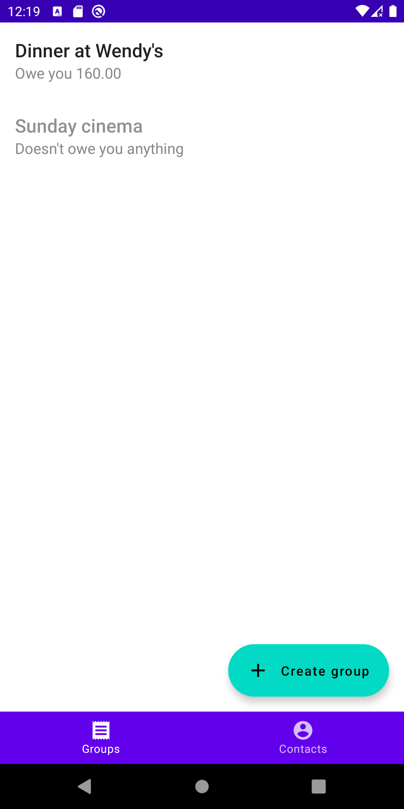
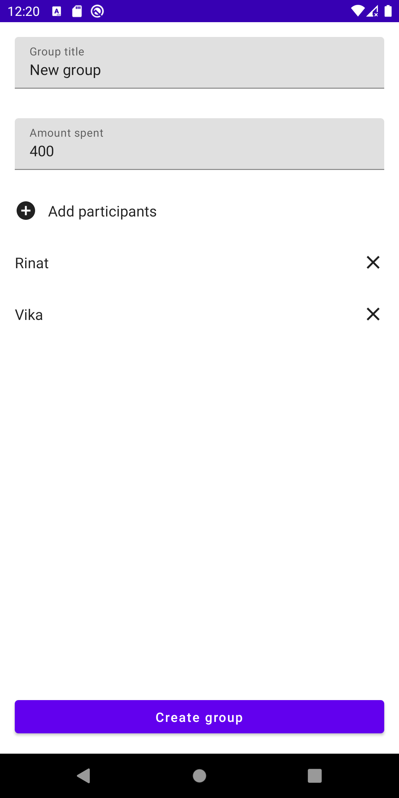
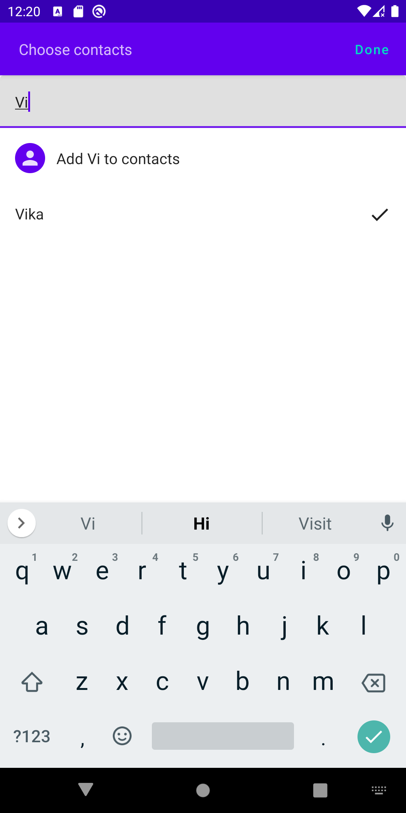
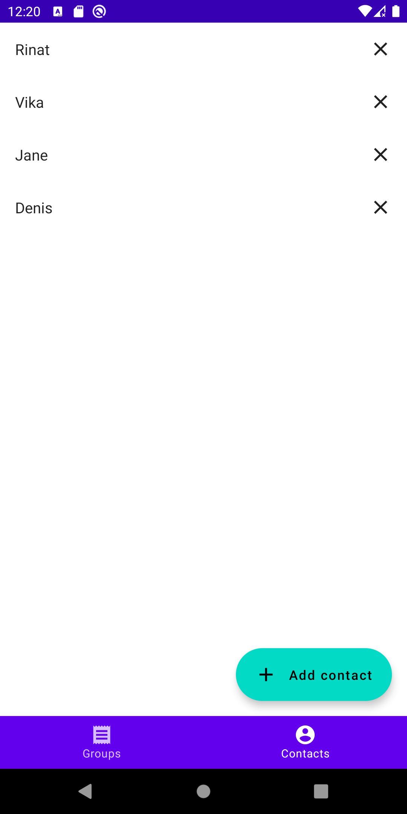
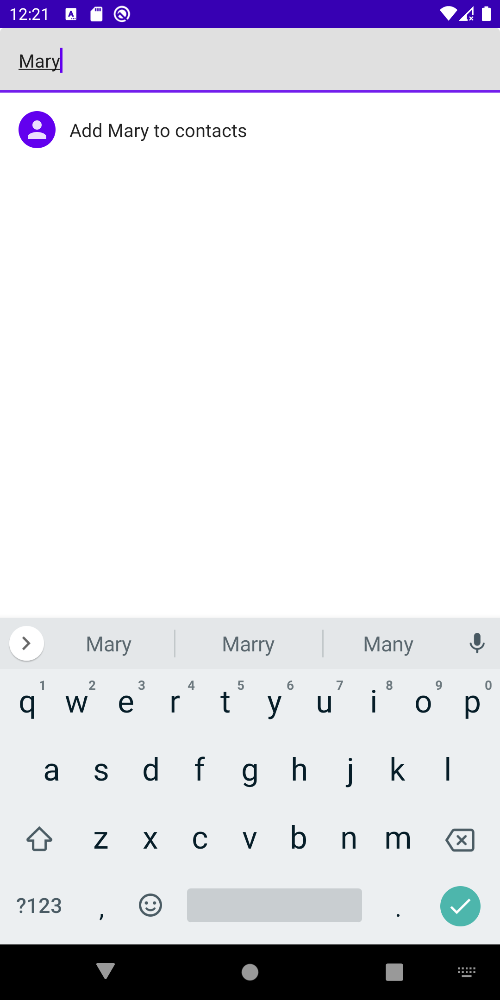
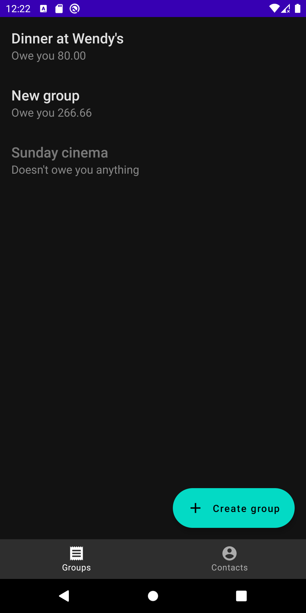
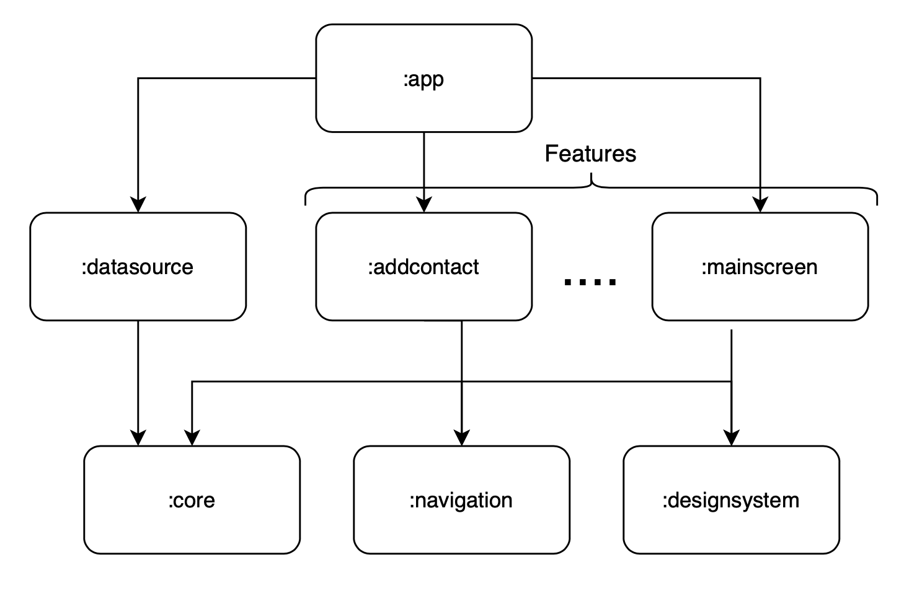

# Split Bill application

Allows to add contacts and then create groups for splitting bill between you and your contacts.

## Screenshots

 
 
 

## Stack

- Jetpack Compose
- MVVM
- Coroutines + Flow
- Dagger 2
- Room

## Modules

### Base

### [base/app](sources/base/app)

Contains Application, root Activity, dagger application component, navigation graph. Provides dependencies for features.

### [base/core](sources/base/core)

Contains domain models, interfaces that should be provided to features.

### [base/datasource](sources/base/datasource)

Contains data-providing logic: repositories implementations, database interactions.

### [base/designsystem](sources/base/designsystem)

Contains theme, color palette and common design elements.

### [base/navigation](sources/base/navigation)

Kotlin module. Contains keys for navigation graph.

### Features

Features may or may not contains composed UI, ViewModel, dagger component, business logic.

- [features/addcontact](sources/features/addcontact) — adding new contacts
- [features/addgroup](sources/features/addgroup) — creating new group
- [features/choosecontacts](sources/features/choosecontacts) — choosing contacts to be added to group
- [features/contactslist](sources/features/contactslist) — list of saved contacts
- [features/groupdetails](sources/features/groupdetails) — information about group and marking contacts who returned the debt
- [features/grouplist](sources/features/grouplist) — list of created groups
- [features/mainscreen](sources/features/mainscreen) — handles bottom bar, floating action button, snackbar

## Build debug version

./gradlew :app:assembleDebug

## Download release version

[Release APK](https://github.com/vacuumlabs-interviews/3rd-round-Vladislav-Yundin/releases/tag/1.0.1)

## Author

**Vladislav Yundin** /
4yundin@gmail.com /
[Resume](https://github.com/Yundin/resume/blob/master/resume_eng.pdf) /
[LinkedIn](https://www.linkedin.com/in/vladislav-yundin-74774b18a/)
